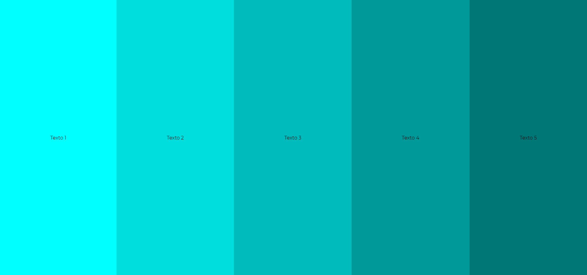

# Ejercicio SASS Bandas (w1exSASSBandas)

Maqueta en HTML y CSS lo que ves en la captura adjunta: .

- Las bandas tienen que ocupar todo el ancho y todo el alto del viewport.
- La maquetación tiene que estar preparada para que haya más de cinco bandas o menos, y se siga viendo bien. No podemos usar una clase diferente para cada banda.
- Haz que cuando se pase el puntero por encima de cada banda, su color de fondo cambie a negro y su color de texto cambie a blanco, y lo haga con transición.
- Haz que cuando se pase el puntero por encima de cada banda:
  - la banda hovereada se vuelva cinco veces más ancha y lo haga con transición
  - su texto dé vueltas y lo haga con transición

Bola extra: Si acabas, pon una imagen de fondo diferente en cada banda. Haz que el texto esté oculto por defecto y aparezca en el hover. Haz que aparezca desde abajo del todo y se ponga en el centro.
